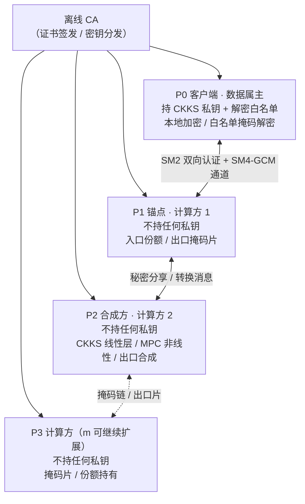
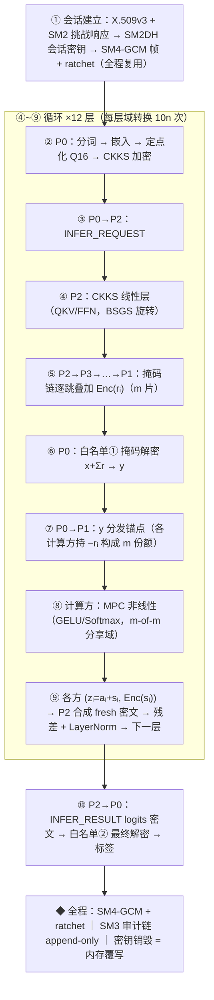

# A1-22 · 面向大模型隐私保护的密码方案（可配置门限 t 版）

> 第十一届全国密码技术竞赛复赛 A1-22 题参赛作品 ｜ 全栈国密 ｜ P0~P7 全链交付 + P8 门限可配置化
> 本仓库 = [主仓库](https://github.com/k4N0SAKU/lyuhan123)（t 固定=1）的**门限可配置版本**：合谋容忍从固定 t=1 升级为 **t = m−1（部署时选定）**


**一句话**：用户输入在本地加密，大模型推理全程只见密文与秘密分享——政务/企业敏感
文本的情感研判结果经"白名单掩码解密"返回客户端，推理节点自始至终拿不到明文；
SM2/SM3/SM4-GCM 管住身份认证、完整性校验与密钥全生命周期。**部署多少个计算方，
就能抵抗至多 t = m−1 方合谋**——掩码分片协议族（D5′）让门限成为部署参数。

|  |  |
|---|---|
| 密码栈 | CKKS（TenSEAL/SEAL）· 模 2^k 加性秘密分享（m-of-m）· Beaver 三元组 · 国密 SM2/SM3/SM4-GCM |
| 门限 | **t = m−1，部署可配置**（m = 计算方数；mode-b 参数下 m ≤ 15，首发部署 m=3 即 t=2） |
| 模型 | BERT-base-chinese 情感二分类（演示主线，微调 acc 99.0%）· GPT-2 124M（生成口径） |
| 形态 | 1+m 方节点（P0 客户端 + m 计算方）+ 离线 CA + FastAPI 演示系统 |
| 规模 | 代码 11,530 行 · 测试 297 passed + 18 deselected + 3 xfailed · 数据字典 93 条四检全绿 |

## 目录

1. [为什么需要这个项目](#1-为什么需要这个项目)
2. [方案概括](#2-方案概括)
3. [名词速查表](#3-名词速查表)
4. [一次密文推理的完整旅程](#4-一次密文推理的完整旅程)
5. [密码方案分层拆解](#5-密码方案分层拆解)
6. [实测结果](#6-实测结果)
7. [威胁模型与攻击测试](#7-威胁模型与攻击测试)
8. [已知限制](#8-已知限制)
9. [快速开始](#9-快速开始)
10. [仓库结构导览](#10-仓库结构导览)
11. [质量门禁与证据纪律](#11-质量门禁与证据纪律)
12. [项目实现全流程](#12-项目实现全流程)
13. [文档与延伸材料](#13-文档与延伸材料)
14. [License](#14-license)

---

## 1. 为什么需要这个项目

**场景一：政务。** 12345 市民热线、一网通办、窗口评价等系统把群众的姓名、证件号、
住址与诉求文本一起送入大模型做摘要、情绪研判与工单分派。按《个人信息保护法》与
等级保护要求，这类数据不得明文出域；而直接把文本粘进公有大模型 API，等于把
"张伟，身份证 110101\*\*\*\*1234，投诉窗口态度"原文交给了第三方——**监管风险与
业务效率直接冲突**：不用大模型，工单堆压；用了，隐私裸奔。

**场景二：企业。** 客服工单、故障报单、内部日志里常含客户手机号、订单号、安全事件
细节。企业希望用大模型自动分类定级（敏感单需安全团队介入），但数据出企业边界即
违反内控与行业合规（金融/医疗尤甚）。

三个共性约束（题面点名，本方案逐条回应）：

| 约束 | 含义 | 本方案的回应 |
|---|---|---|
| **可用不可见** | 推理必须完成，但原始输入与中间激活不得泄露给任何一方 | 输入只在 P0 本地加密；计算方全程只见密文与秘密分享（§4） |
| **资源可落地** | 中小企业没有 GPU 集群——方案要能在普通服务器运行、开销可预期 | 全栈 CPU-only 实测；四项资源指标逐项给出（§6） |
| **商用密码合规** | 国内政企采购要求国密算法支撑身份与传输安全 | 控制面全链国密：SM2 认证/密钥协商、SM4-GCM 通道、SM3 审计链（§5.5） |

现状做法为什么不行：明文直传（无保护）；平台侧隐私条款承诺（不可验证、不可审计）；
传统 MPC/FHE 框架直接上（无国密、无业务身份体系、部署重、时延或资源失控）——
逐项对比见 [docs/04-性能与基线对比.md](docs/04-性能与基线对比.md)。

## 2. 方案概括

把推理任务拆给一个数据属主与 m 个互不信任的计算方，用密码学保证"谁也拼不出
明文"——**合谋门限随部署规模伸缩**：

| 角色 | 拿到什么 | 拿不到什么 |
|---|---|---|
| **P0 客户端**（数据属主，信任根） | 明文输入、CKKS 私钥、解密白名单 | ——（数据出自己手之前就已加密） |
| **P1 锚点**（计算方 1） | 掩码解密值 y（OTP 域）、自己的掩码片 | 任何明文（不持任何私钥） |
| **P2 合成方**（计算方 2） | CKKS 密文、OTP 值 w=v+Σs、自己的掩码片 | 任何明文（不持任何私钥） |
| **P3..Pm 计算方**（可选扩展） | 密文/份额、自己的掩码片 | 任何明文（不持任何私钥） |
| **离线 CA** | 证书签发、密钥分发 | 不参与推理，不接触业务数据 |



两条运行模式 + 一个门限维度：

- **模式 B**（主线，演示与评测采用）：CKKS 密文跑线性层 + MPC 跑非线性层，
  中间用 D5′ 转换协议在两种密文形态间切换；
- **模式 A**（纯同态全密文）：题面路线提示之一。本栈当前不可实例化
  （SEAL 参数上限，详见 [docs/01 §5.3](docs/01-架构与协议规格.md)），
  理论设计保留；攻击测试对两模式分别执行，不混淆口径；
- **门限配置（本仓库新增，P8）**：**t = m−1**——部署 m ∈ [2, 15] 个计算方
  （mode-b 参数），即可抵抗至多 t 方计算参与方合谋。同一套代码：m=2 严格
  退化为三方原版（[主仓库](https://github.com/k4N0SAKU/lyuhan123)行为），
  m=3 起门限生效。

## 3. 名词速查表

| 名词 | 一句话解释 |
|---|---|
| **同态加密 / CKKS** | 一种"能直接对密文做算术"的加密；CKKS 支持实数向量的加法与近似乘法，适合神经网络线性层 |
| **MPC（安全多方计算）** | 多方各持一份秘密输入，协作算出结果但互相不知道对方的输入 |
| **加性秘密分享** | 把秘密 x 拆成多份随机数之和；单独任意不足 t+1 份都是均匀随机，合起来才是真值 |
| **门限 t（可配置）** | 部署 m 个计算方 ⇒ 可抵抗至多 **t = m−1** 方合谋（缺至少一片均匀掩码 = 信息论一次一密）；t 在**供给阶段选定**，上限由参数集精度域决定（mode-b：t ≤ 14） |
| **掩码片（mask piece）** | D5′ 协议族的核心：每个计算方独持一片 fresh 随机掩码，入口链式叠加、出口分片加密汇总——**任何一方都不掌握完整掩码** |
| **Beaver 三元组** | 预生成的一组随机数 (a,b,c) 满足 a·b=c，让 MPC 里"密文乘密文"只需一次开放操作 |
| **域转换（D5′ 协议族）** | 在 CKKS 密文形态与秘密分享形态之间切换的 m 方协议——本方案的关键粘合剂（§5.2） |
| **白名单掩码解密** | P0 只对"转换掩码值"和"最终输出"两类值解密，且只能得到白名单值域内的结果（§5.4） |
| **SM2 / SM3 / SM4** | 国密算法：SM2 椭圆曲线公钥密码（签名/密钥协商）、SM3 哈希、SM4 分组密码 |
| **SM4-GCM** | SM4 的认证加密模式：同时保证机密性与完整性（本仓库自实现并以 RFC 8998 标准向量锚定） |
| **ratchet（棘轮）** | 会话密钥按规则持续轮换，单条密钥泄露不影响前后流量的机密性 |
| **半诚实模型** | 敌手会忠执行程、试图从看到的数据里捞信息——本方案的安全声明口径（§7） |
| **定点化（Q16/Q22）** | 把浮点数按固定小数位缩放成整数，让密码电路能算——激活 Q16、GPT-2 权重 Q22 |

更完整的术语表见 [docs/glossary.md](docs/glossary.md)。

## 4. 一次密文推理的完整旅程

以一次情感分类请求为例（BERT 12 层；演示管线为截断层口径；m=3 部署）：



为什么每一步都不泄密：

| 步骤 | 谁看见什么 | 为什么安全 |
|---|---|---|
| ② 本地加密 | 明文只存在于 P0 内存 | 输入加密后才离开 P0，通道上还有 SM4-GCM 加密 |
| ④ CKKS 线性层 | 计算方只见 CKKS 密文 | CKKS 在无私钥时不可逆（IND-CPA，§7 攻击实证） |
| ⑤ 掩码链 | 每个计算方只见"密文 + 前缀片和" | 自己的片 rᵢ 自己独持；完整掩码 = m 片之和，**任何 m−1 方都缺至少一片** |
| ⑥ 掩码解密 | P0 解出的是 x+Σr，被完整掩码遮住 | 掩码片均匀随机且分散在各计算方；解密白名单限定值域与次数 |
| ⑧ MPC 非线性 | 各方持一份 m-of-m 加性分享 | 单份/不足 t+1 份都是均匀随机；t=m−1 门限（§7） |
| ⑨ 出口合成 | 合成方只见 OTP 值 w=v+Σs 与各片密文 Enc(sᵢ) | 缺任意一片 sⱼ 就无法剥离掩码；合成结果为 fresh 密文 |
| ⑩ 结果解密 | P0 只解出最终 logits | 解密白名单②只含最终输出这一处 |

## 5. 密码方案分层拆解

### 5.1 数据面 · CKKS 线性层

- 权重用**对角线方法**打包进明文多项式，密文向量乘权重矩阵化为一系列
  密文旋转 + 明文乘加；旋转用 **BSGS**（baby-step giant-step）分解降低旋转次数；
- 本栈（TenSEAL 0.3.14 / SEAL）密文维度上限 **2^15 = 16384 槽**（n≥2^16 一律
  被 SEAL 校验拒绝，决策记录见 [docs/01 §5.3](docs/01-架构与协议规格.md)）；
- 实测：768×768 单线性层约 4.2~4.5s（CPU，L=2 回环）——这是全系统时延的
  主导项之一，如实呈现（§6）。

### 5.2 关键难点 · 域转换协议族 D5′（m 片掩码）

线性层输出是 CKKS 密文，非线性层要的是加性秘密分享——两者之间靠 D5′
协议族切换。**核心思想：完整掩码拆成 m 片，每个计算方独持一片**：

1. **入口（ct → m 份额）**：掩码链 P2→P3→…→Pm→P1，各计算方独立采样掩码片
   rᵢ 并密文域叠加 Enc(rᵢ)（按目标精确 scale 编码）；P0 白名单①解密
   y = x + Σrᵢ，分发锚点 P1；份额 x₁ = y−r₁（锚点）、xᵢ = −rᵢ（i≥2），
   Σxᵢ = x (mod 2⁶⁴)；
2. **MPC 非线性**：m-of-m 加性分享域完成 GELU/Softmax（Beaver 三元组 m 方
   开放，d·e 记锚点一方）；
3. **出口（m 份额 → ct，RECRYPT）**：各计算方采样 sᵢ，发 (zᵢ = aᵢ+sᵢ,
   Enc(sᵢ)) 给合成方；w = Σzᵢ = v+Σsᵢ（OTP 域，m 缩放界守卫）；
   ct = Enc(w) − ΣEnc(sᵢ) = Enc(v)，fresh 顶层密文。

安全语义：**任意 t ≤ m−1 方合谋至少缺一片均匀掩码** ⇒ 信息论 OTP，
泄漏界与单片版相同、不随 m 劣化（[docs/02 附录 A](docs/02-威胁模型与安全分析.md)）。
工程上跨过的精度墙（rescale scale 漂移、float64 2⁵³ 域、掩码量级放大）与
处理方式完整记录在
[docs/code-walkthrough.md](docs/code-walkthrough.md)。
每层 Transformer 触发 **10n 次域转换**（n 为 token 数）。

### 5.3 非线性算子 · MPC

GELU/Softmax 等非线性无法直接同态计算，用 **minimax 多项式近似** +
**Beaver 三元组在线乘法**在秘密分享域完成；三元组由离线预生成
（`src/nodes/offline_triple_gen.py`），m 方份额化分发（`src/crypto/beaver_m.py`）。

### 5.4 解密白名单

P0 虽然持有唯一私钥，但解密被约束在**白名单**内：①域转换掩码值（且值域受限）、
②最终输出。设计意图：即便 P0 侧实现被滥用，也不存在"随手解出中间激活"的路径。
这是 P1-R1 评审对 D5 的关键修订，D5′ 延续该设计（P0 解密触点不变）。

### 5.5 控制面 · 全链国密

| 组件 | 做法 | 质量锚点 |
|---|---|---|
| 身份认证 | X.509v3 结构化证书 + SM2 挑战响应双向认证（离线 CA） | 演示级证书体系（§8）；协议族测试覆盖 |
| 密钥协商 | SM2DH 会话密钥（GB/T 32918.3） | 双端密钥一致性由规范标签派生 |
| 安全通道 | SM4-GCM 认证加密，自实现（gmssl 无 GCM） | **RFC 8998 附录 A.1 外部标准向量锚定**——密码组合层的黄金标准 |
| 密钥轮换 | ratchet 前向轮换 + KEY_ROTATE（transcript 基准=本帧前链值） | 单帧密钥泄露不回溯污染 |
| 审计 | SM3 哈希链 append-only，防篡改 | 200 线程并发 append 测试覆盖（`test_concurrent_append_200`） |
| 销毁 | 密钥状态机 + 两遍覆写零化 | 生命周期测试覆盖注册→轮换→销毁全链 |

### 5.6 参数、门限与安全强度

- CKKS 参数采用 **2^15 提交主线 + 2^16 评审路径**双口径
  （[docs/01](docs/01-架构与协议规格.md) 参数表）；安全强度用
  **lattice-estimator（malb）@ SageMath** 实测评估，存档于
  `benchmarks/results/security_estimator.json`；
- **门限上限**：mode-b 参数下 **m ≤ 15（t ≤ 14）**——由 float64 2⁵³ 精确
  整数域反推（掩码总窗 ≤ m·2⁴⁹），`conversion_m.check_m` 代码级强制；
  m=2~15 全谱实测通过（§6）。

## 6. 实测结果

> 每个数字都可回读到生成它的 JSON（§11 证据纪律）；"口径"列防止误读。

| 指标 | 数值 | 口径 | 证据 |
|---|---|---|---|
| 模型满配精度（INT8+Q16，**明文口径**） | accuracy **99.00%**（n=200，vs FP32 0.00pp） | 满配 12 层、自建集同源对照；**这是明文量化精度，非密文推理口径**——密文侧主张见下行 | `p6_full_bench.json::plaintext.bert_accuracy_full12_quantized` |
| 密文管线一致性（密文口径） | 密文管线标签与其明文同构参考**一致**（截断层；m=2/3/15 三配置 label 一致、概率差 ≤2e-6） | 截断演示管线；满配 12 层密文端到端未测（§8） | `tests/e2e/test_pipeline_m_equivalence.py` |
| 定点化一致率 | **100%** | 激活 Q16 + 权重 Q22 vs 浮点 | `quantize_eval_*.json` |
| 明文基线 | BERT **23.6ms** / GPT-2 **677.2ms** | 单轮 P50，20 轮，threads=8 | `p6_full_bench.json::plaintext` |
| 密文矩阵耗时 | 4/8/12 层 P50 **121.7 / 237.7 / 371.8s** | 20/20×3 配置，L=2 回环 CPU，截断层性能口径（m=2 拓扑） | `p6_full_bench.json::cipher_matrix` |
| **m 方转换代价曲线（P8）** | m=2~15：转换往返 p50 **1131 → 8766 ms**、**6.6 → 40.9 MiB**/轮，随 m 近线性 | mode-b 全槽 16384，每 m 3 轮全槽断言（±4 ulp 红线内）；出口翻转率 0% | `mparty_sweep_m2_15.json` |
| **m 方稳定性（P8）** | m=3 × 10 轮转换往返全部红线内；m=3 真实通道生命周期 **max_abs_err ≤ 4/2¹⁶** | 玩具参数端到端（5 链路） | 生命周期 e2e + `mparty_cost_curve.json` |
| **合谋矩阵（P8）** | **t∈{1..14} 全域实测闭环**：m=3 全 6 视角枚举、m=4 代表 6 视角、m=5~15 每档 3 个最坏 size-(m−1) 组合——精确恢复成功率 **0** | 半诚实计算参与方，30 试验/视角 | `tests/attack/test_collusion_mparty*.py` |
| C2 模型瘦身选型（创新点） | 模型体积**省 34.1%**（474.7→312.7 MiB），瘦身前后预测结果**一字不差**（一致率 1.000） | 最优组合=卷积/线性权重存 fp16 + 嵌入层 22 位定点；判据=端到端预测一致（白话版见下） | `p6_full_bench.json::c2_selector` |
| C3 密文矩阵乘同题竞赛（创新点） | "行和"算法**慢 5.39×/5.14×**（向量维度 256/512），对角线+BSGS 胜出 | 早期预估行和法快 1.3×，实测被推翻——**如实入报告的负结果**（白话版见下） | `p6_full_bench.json::c3_ab` |
| 攻击判定 | **28 防御成功 + 2 边界演示 + 0 失败** | 五类攻击 30 项判定（原口径）+ m 方合谋矩阵 | `attack_verdicts.json` |
| 测试 | **297 passed + 18 deselected + 3 xfailed**；攻击套件 40 项 | pytest 默认口径（slow 已排除） | `python -m pytest -q` |

**两个创新点的白话版**：

- **C2 = 给模型"瘦身"的自动选型器。** 加密计算前，模型权重必须先从浮点数压成
  整数（定点化）：压得太狠会算错，压得太轻模型太大。选型器把各种压缩组合逐一
  试算，自动挑出"体积最小、且预测结果与压缩前完全一致"的一组——结果：模型文件
  从 474.7 MiB 瘦到 312.7 MiB（省 34.1%），预测与瘦身前一字不差。这里有个如实
  记录的教训：按"单层误差小"挑组合会翻车（如嵌入层压到 8 位整数时，一致率从
  1.000 跌到 0.3063），所以判据必须用"端到端预测一字不差"这道闸门。
- **C3 = 两种"密文×权重矩阵"算法的同题竞赛。** 密文推理的每个线性层都要算
  "加密向量 × 权重矩阵"。业界常用"对角线打包+旋转"法，另有一种看起来更简单的
  "行和"法。同一道题、两种实现、各跑一遍：行和法反而慢 5.39 倍（向量维度 256）/
  5.14 倍（维度 512）——早期曾预估它快 1.3 倍，被实测推翻。我们把"当初为什么
  预估错、错在哪"如实写进报告，最终选型对角线+BSGS。

性能位置（如实）：密文路径为分钟级（回环 CPU、截断层口径），与文献 MPC 方案
同处"数量级开销"区间；差异在结构——同态分段刷新减少交互轮次、转换主导通信、
单机可跑（文献均为 Linux 集群口径）。逐项五维对比（本机/SPU/PUMA/MPCFormer/
BumbleBee，含"不可比因素"说明列）见 [docs/04](docs/04-性能与基线对比.md)。

## 7. 威胁模型与攻击测试

- **敌手口径**：半诚实**计算参与方** + 恶意网络；敌手能力表 A1~A5、假设核对表
  A-1~A-9、半诚实模拟器论证见 [docs/02-威胁模型与安全分析.md](docs/02-威胁模型与安全分析.md)；
- **合谋门限（可配置，本仓库核心增量）**：**t = m−1 精确到门限**——任意 t 个
  计算方合谋至少缺一片均匀掩码（信息论 OTP，统计检验 + 合谋矩阵自动化实证）；
  **t 在供给阶段选定**（m ∈ [2, 15]，mode-b）；P0 为数据属主信任根——
  {P0, ·} 合谋超出声明模型，如实留表（§8）；
- **模式 A 防御**：CKKS IND-CPA + 重加密——同明文重加密字节重合率 ≈1/256
  （随机性实证）。

五类攻击自动化测试（`tests/attack/`，51 项用例 → 30 项判定 + m 方合谋矩阵）：

| 攻击类型 | 攻击者动作 | 结果 |
|---|---|---|
| 窃听 | 全程抓取通道字节做模式扫描/熵分析 | 防御成功 |
| 中间人 | 替换证书/篡改握手转录 | 防御成功（证书校验 + transcript 链） |
| 结果篡改 | 修改密文/审计链注入 | 防御成功（GCM 认证标签 + SM3 链校验） |
| 重放 | 重发历史密文帧 | 防御成功（序列号 + 滑动窗口拒绝） |
| 合谋 | t ≤ m−1 计算方联合推理 | **t=m−1 防御成功**（m=3/4 矩阵实证）；{P0,·} 边界（预先申报） |

复跑口径注意：`attack_verdicts.json` 每次会话覆盖，完整判定集需单次会话
`python -m pytest tests/attack -o addopts=` 落盘（§9）。

## 8. 已知限制

与所有真实系统一样，本方案有明确的工程边界，集中列明如下
（完整分析见 [docs/00 §3](docs/00-方案概述.md) 与 [docs/02 附录 A](docs/02-威胁模型与安全分析.md)）：

1. **时延**：现网明文服务百毫秒级，本方案密文路径分钟级（回环 CPU 口径）——
   瓶颈为 CKKS 明文矩阵乘与转换往返；GPU 加速、定点线性层、转换批量化是
   明确的工程优化方向（docs/05 §3）；
2. **模式 A 缺口**：全密文路线受当前后端（SEAL）参数上限限制，理论设计保留，
   需 OpenFHE 级后端实例化（docs/01 §5.3）；
3. **证书体系为演示级**：结构化签名对象；生产部署应替换为 GM X.509 证书链
   （docs/01 §4.1）；
4. **数据面算法选型**：控制面全链国密，密文计算引擎为国际标准 CKKS——
   纯国密同态库依赖国产生态，列为扩展方向（docs/04 §7）；
5. **底座模型为演示级**：情感二分类微调（acc 99.0%）+ 截断层数演示管线——
   业务语义映射为示例，非生产模型（docs/04 §6 精度口径分表）；
6. **精度评测外部锚点**：当前为自建数据集同源对照（n=200）；ChnSentiCorp 等
   公开数据集的三口径评测为规划中的扩展工作；
7. **{P0, ·} 合谋超出声明模型**：P0 是钥持者+数据属主（信任根）——P0 与任一
   计算方合谋可解开中间态。这是客户端辅助 MPC 的标准信任假设，但它是假设：
   需要更高容忍时，路线 = 门限化 CKKS 密钥（受 s² 交叉项与噪声泛洪-精确回收
   互斥两堵墙限制，[docs/02 附录 A](docs/02-威胁模型与安全分析.md) 登记）；
8. **m-of-m 零容错**：任一计算方掉线协议停滞——加性分享无 Shamir k<n 式
   冗余；冗余化需环上拉格朗日插值（域论代价），登记为扩展方向；
9. **t 在供给阶段锁定**：会话中途不可动态增减计算方（与 Shamir (k,n) 部署
   语义一致）；门限上限 mode-b 下 t ≤ 14。

## 9. 快速开始

环境要求：**Python 3.10+，CPU-only 即可**（实测开发机 Windows / 32GB 内存）；
首次运行需联网下载模型约 1.5GB（HuggingFace 不可达时自动切换 hf-mirror.com 镜像）。

```bash
# 1) 环境与依赖
python -m venv .venv && source .venv/bin/activate      # Windows: .venv\Scripts\activate
pip install -r requirements.txt                        # 精确复现用 requirements-lock.txt

# 2) 模型与微调检查点
python -m benchmarks.download_models                   # BERT/GPT-2 三件套（HF/镜像自动探测）
python -m benchmarks.finetune_bert                     # 情感分类头微调（CPU 数分钟，acc 99.0%）

# 3) 跑演示系统（全模拟数据，浏览器打开 http://127.0.0.1:8060/）
python -m src.demo.app --port 8060
```

**体验可配置门限（本仓库新增，玩具参数秒级贯通）**：

```bash
# 1) 供给 1+m 方身份（m=3 ⇒ t=2；t 上限 14）
python -m src.nodes.provision_m --dir data/prov_m3 --m 3 --toy

# 2) 生命周期 e2e：5 条链路认证+SM2DH → 掩码链式转换 → 白名单解密 → ratchet → 销毁 → 审计核验
python -m src.nodes.orchestrator_m --prov-dir data/prov_m3 --m 3

# 3) 代价曲线：m=2~15 全谱转换往返实测（延迟/字节随 m 线性）
python -m benchmarks.bench_mparty --m-min 2 --m-max 15 --rounds 3
```

**测试三档**：

```bash
python -m pytest -q                        # 默认口径：297 passed + 18 deselected + 3 xfailed
python -m pytest tests/attack -o addopts=  # 攻击套件 51 项（~10 分钟；单次会话落盘 attack_verdicts.json）
python -m pytest -m slow -q                # 演示稳定性 10 轮 / 管线等价 / m=15 边界等慢速项（~40 分钟）
```

**复现基准**（数字只能由这些脚本写入 `benchmarks/results/`）：

```bash
python -m benchmarks.perf_runner                                        # 明文基线（多轮区间呈现）
python -m benchmarks.run_full_bench --parts cipher_matrix --cipher-rounds 20 --segmented   # 密文矩阵（分段子进程）
python -m benchmarks.run_full_bench --parts c2_selector,c3_ab --rounds 20                  # 创新点 A/B
python -m benchmarks.run_full_bench --parts tables                                          # 汇总表注入 docs/04/05
python -m benchmarks.bench_mparty --rounds 10                                           # m 方代价曲线（m=2~5）
```

**一键复现**（干净目录 6 步链：venv→依赖→模型→管线→基准→攻击，
证据存档 `reproduce_logs/`，详见 [docs/06-复现手册.md](docs/06-复现手册.md)）：

```bash
bash scripts/reproduce.sh
```

**文档一致性门禁**（改任何文档后必跑）：

```bash
python scripts/check_docs_consistency.py   # 四检（数据字典/注入表/黑名单/互引）
```

## 10. 仓库结构导览

```
├─ src/                      # 系统源码
│  ├─ protocol/              #   消息序列 messages · 认证 auth · 会话 session（SM2DH/GCM/ratchet）
│  │                         #   密钥生命周期 keylifecycle · 审计链 audit_log
│  │                         #   转换 conversion（D5 两方）· conversion_m（D5′ m 方协议族 ★）
│  ├─ crypto/                #   ckks_ops（CKKS 封装/BSGS）· secret_sharing(_m) · beaver(_m)
│  │                         #   gm_cipher（SM4-GCM）· threshold
│  ├─ model/                 #   pipeline（密文推理主管线）· pipeline_m（m 方参数化 ★）
│  │                         #   quantize（定点化）· ops/（linear/minimax/packing/rowsum）
│  ├─ nodes/                 #   client / keynode / infernode 三方节点 · maskparty（m 方计算方 ★）
│  │                         #   provision(_m) 供给 · orchestrator(_m) 编排 · offline_triple_gen
│  ├─ common/                #   perf 指标 · envinfo 环境快照 · netmeter 流量计量
│  └─ demo/                  #   FastAPI 演示系统（2 场景，全模拟数据）+ 单页 UI
├─ benchmarks/               # 全部性能/安全数字的唯一合法产地（D8 纪律）
│  ├─ perf_runner.py         #   明文基线（多轮区间呈现，threads 锁定）
│  ├─ run_full_bench.py      #   四项资源指标 + 密文矩阵 + 创新点 A/B（--segmented 分段子进程）
│  ├─ bench_mparty.py        #   m 方代价曲线（m=2~15 扫描 ★）
│  ├─ eval_pipeline_accuracy.py / eval_quantize.py / finetune_bert.py / download_models.py
│  ├─ security_estimator.py  #   格估计器对接（lattice-estimator @ SageMath/WSL）
│  ├─ package_phase.py       #   阶段打包器（pN.zip + MANIFEST + sha256）
│  └─ results/               #   全部实测 JSON（UTC 时间戳）+ estimator 原生日志存档
├─ tests/                    # 三层测试
│  ├─ unit/                  #   原语/协议/管线单元测试（含 m=2~15 全谱 ★）
│  ├─ attack/                #   五类攻击套件 + 合谋矩阵（m=3/4 ★）+ 内存取证框架
│  └─ e2e/                   #   端到端：管线/生命周期/明文基线/演示稳定性/m 方等价与边界（★）
├─ docs/                     # 参赛文档七件套 + 数据字典 + 工程档案（§13）
├─ scripts/                  # check_docs_consistency（四检）· gen_data_dict · reproduce.sh
├─ deliverables/             # p0~p8 阶段交付包 + sha256 侧车
├─ reproduce_logs/           # 干净目录一键复现的逐步证据
└─ data/models/              # 模型文件（~1.5GB，不入库：python -m benchmarks.download_models 一键复现）
```

（★ = 本仓库相对主仓库新增的门限可配置组件；主仓库对应文件零改动。）

## 11. 质量门禁与证据纪律

这套项目最看重的不是某个单点数字，而是**每个数字都能被第三方重新算出来**：

- **D8 纪律**：性能数字只允许由 benchmark 脚本写入 `benchmarks/results/`
  （UTC 时间戳 JSON）；文档引用与 JSON 保持一致，杜绝手填；
- **数据字典**：`docs/data_dict.json` 收录 **93 条**指针，每个文档主张都能回读到
  具体 JSON 字段；由 `scripts/gen_data_dict.py` 自动生成；
- **四检门禁**（`scripts/check_docs_consistency.py`，EXIT=0 才算过）：
  ① 字典 ↔ 源 JSON 回读一致；② 注入表与 JSON 字节一致；③ 过期值黑名单
  （自动拦截旧数值回流文档）；④ 文档互引完整；
- **边界透明**：全部已知限制集中在 §8 列明，不做隐藏性声明。

## 12. 项目实现全流程

开发全程采用**阶段门工作流**：P0~P7 每阶段末输出工作记录 + 交付包（pN.zip +
MANIFEST + sha256）+ 阶段报告，评审通过后进入下一阶段；P8（门限可配置化）在
隔离分支沙箱完成实现与全谱实测后并入本仓库。全部过程留档
[docs/phases/](docs/phases)。研发过程与运行时数据流的全景图见顶部。

| 阶段 | 目标 | 状态 |
|---|---|---|
| P0 | 环境、明文基线（GPT-2 P50 792.4ms / BERT 38.4ms，threads=8）、定点化预研、性能框架 | ✅ 评审通过 |
| P1 | 架构与协议规格（三方职责 / 消息序列 S1~S8 / D5 转换协议） | ✅ 评审通过 |
| P2 | 密码原语层（CKKS / SM2DH / SM4-GCM / 定点化一致率 100%） | ✅ 评审通过 |
| P3 | 密文推理管线（模式 B 端到端贯通，220 prompts 一致率 1.0000） | ✅ 评审通过 |
| P4 | 认证与密钥全生命周期（证书 / 会话 / ratchet / 审计链 / 销毁） | ✅ 评审通过（2026-09-27） |
| P5 | 威胁模型终稿 + 五类攻击自动化（38 项零告警，28+2+0） | ✅ 评审通过 |
| P6 | 性能与基线对比（四指标 + 密文矩阵 20/20×3 + 创新点 C2/C3） | ✅ 评审通过 |
| P7 | 演示系统 + 七文档终稿 + 终检（F1~F10：8 √ + 2 √*） | ✅ 终检通过（2026-09-30） |
| **P8** | **门限可配置协议族（t = m−1）：m 片掩码 / m 方 MPC / 合谋矩阵 / m=2~15 全谱实测** | ✅ 完成（本仓库） |

## 13. 文档与延伸材料

| 文档 | 内容 |
|---|---|
| [docs/00-方案概述.md](docs/00-方案概述.md) | 痛点/方案/边界（封面 v1.0，数据字典声明） |
| [docs/01-架构与协议规格.md](docs/01-架构与协议规格.md) | 九章规格 + 附录 A（D5′ m 方协议族规格草案） |
| [docs/02-威胁模型与安全分析.md](docs/02-威胁模型与安全分析.md) | 敌手能力表、假设 A-1~A-9、模拟器论证 + 附录 A（m 方合谋抵抗分析） |
| [docs/03-攻击测试报告.md](docs/03-攻击测试报告.md) | 五类攻击 30 项判定（28+2+0） |
| [docs/04-性能与基线对比.md](docs/04-性能与基线对比.md) | 四项资源指标、五维对比（逐项标数据来源与不可比因素） |
| [docs/05-创新点报告.md](docs/05-创新点报告.md) | C2 参数自适应 / C3 双实现选型（A/B 实测） |
| [docs/06-复现手册.md](docs/06-复现手册.md) | 一键复现 6 步链与证据 |
| [docs/glossary.md](docs/glossary.md) | 术语表 |
| [docs/code-walkthrough.md](docs/code-walkthrough.md) | 模块代码导读（按模块讲"这段代码在干嘛"） |
| [docs/project-overview.md](docs/project-overview.md) | 项目详细介绍与全过程 |
| [docs/项目解释书.md](docs/项目解释书.md) | 项目解释书（记号约定/架构边界/逐阶段实现/结果口径导航/报告书写作建议）★ |
| [docs/phases/P8-阶段提案.md](docs/phases/P8-阶段提案.md) | 门限可配置化提案（威胁模型重申报 + 验收标准）★ |
| [docs/phases/P8-工作记录.md](docs/phases/P8-工作记录.md) | P8 实现全记录（含精度口径校准发现）★ |
| [docs/文献核验笔记-EncFormer.md](docs/文献核验笔记-EncFormer.md) | EncFormer 文献核验与移植清单 ★ |
| [docs/优化记录-加解密速度与通信开销.md](docs/优化记录-加解密速度与通信开销.md) | 加解密速度与通信开销优化记录（P9）★ |
| [docs/phases/](docs/phases) | P0~P7 工作记录 + 项目总结报告 + 阶段任务登记 |
| [docs/review/](docs/review) | 历轮评审记录与 R 修订对照表（P1~P3、P7） |

## 14. License

见 [LICENSE](LICENSE)（参赛作品版权声明）。第三方依赖（PyTorch、Transformers、
TenSEAL/SEAL、gmssl、FastAPI 等）遵循各自开源许可。
